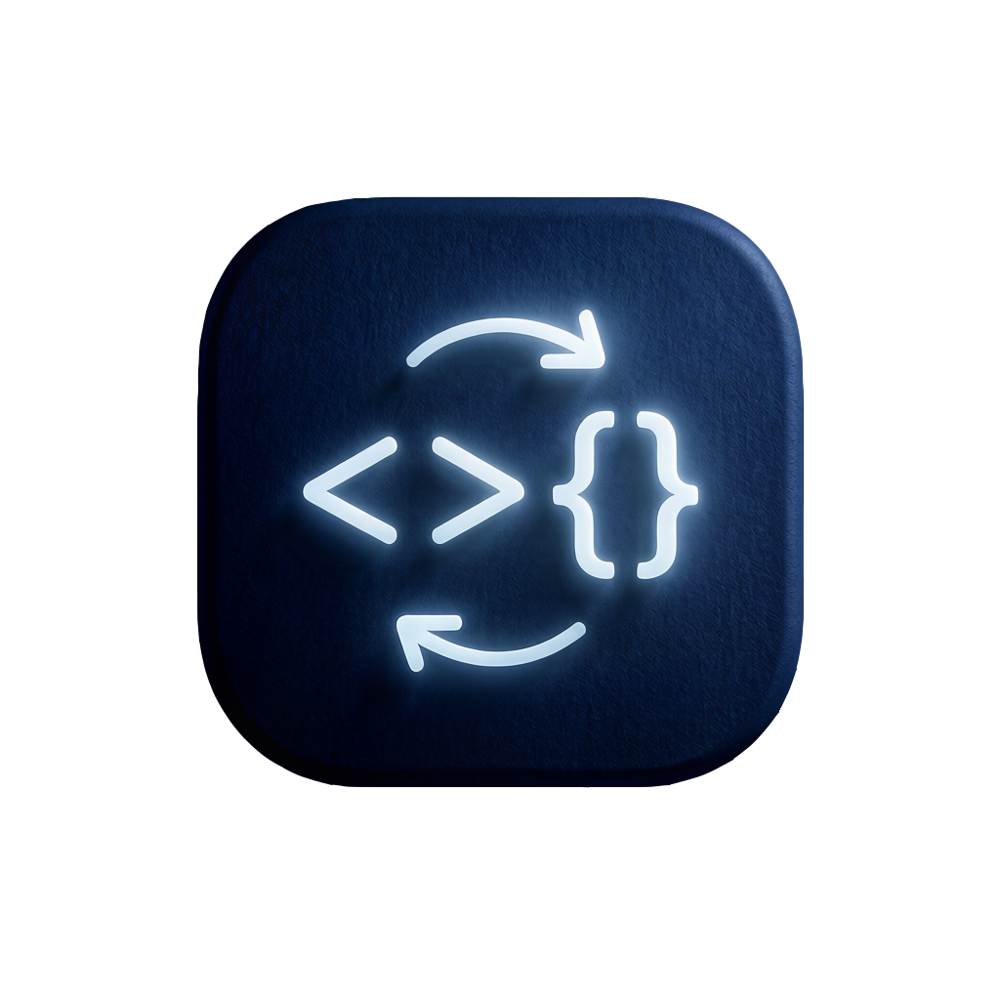

<div align="center">

#  Code Translator

**AI 驱动的代码翻译平台**

[English](./README.md) · [中文](./README_ch.md)

---

</div>

## 📖 项目简介

Code Translator 是一个智能代码翻译工具，可以将整个编程项目从一种语言转换为另一种语言。基于大语言模型（LLM），它不仅仅是简单的语法转换 —— 它会**理解**你的代码，在不确定时**搜索**相关知识，在有歧义时**询问**你的需求，并在翻译后**验证**输出结果。

### ✨ 核心特性

| 特性 | 描述 |
|------|------|
| 🧠 **智能分析** | 翻译前深入分析项目结构、依赖关系和代码逻辑 |
| 🔍 **自动检测源语言** | 上传文件后根据扩展名自动识别源编程语言 |
| 🔎 **网络搜索** | 不确定时自动搜索语言特定的知识 |
| ❓ **交互问答** | 需求有歧义时主动提问，确保翻译准确 |
| ✅ **翻译后验证** | 检查语法错误、缺失导入、逻辑问题等 |
| 🔄 **自动流水线** | 三步流水线自动执行：**分析 → 翻译 → 验证** |
| 📂 **历史管理** | 基于 SQLite 持久化保存和加载翻译历史 |
| 💾 **ZIP 下载** | 将所有翻译文件导出为 ZIP 压缩包 |
| 🌐 **实时进度** | 基于 WebSocket 的实时进度更新和 Agent 对话 |

### 🏗️ 架构

```
┌──────────────┐       ┌──────────────┐       ┌───────────────────┐
│   浏览器     │──────▶│  Next.js     │─────▶│  SQLite (Prisma)  │
│              │       │  前端        │       │  翻译历史记录      │
└──────────────┘       └──────┬───────┘       └───────────────────┘
                              │ WebSocket / REST (proxy to :3003)
                              ▼
                       ┌──────────────────┐
                       │  FastAPI         │
                       │  Agent 服务      │
                       └──────┬───────────┘
                              │ OpenAI 兼容 API
                              ▼
                       ┌──────────────────┐
                       │  LLM 提供商       │
                       │  (用户自定义)     │
                       └──────────────────┘
```

**技术栈：**

- **前端：** Next.js 16 · React 19 · TypeScript · Tailwind CSS 4 · shadcn/ui · Zustand · Framer Motion
- **后端：** Python · FastAPI · WebSocket · Pydantic
- **数据库：** SQLite（通过 Prisma ORM）
- **AI：** 任何 OpenAI 兼容的 LLM API

---

## 🚀 安装

### 前置条件

| 依赖 | 版本 | 用途 |
|------|------|------|
| **Node.js** | ≥ 18 | 前端运行时（内置 **npm**） |
| **Python** | ≥ 3.10 | 后端运行时 |
| **pip** | 最新版 | Python 包管理器 |
| **LLM API** | — | OpenAI 兼容端点（OpenAI、Azure、本地 LLM 等） |

---

### 🍎 macOS 安装

#### 第 1 步：安装 Node.js（内置 npm）

```bash
# 通过 Homebrew 安装 Node.js（推荐）
brew install node

# 或通过 nvm（Node 版本管理器）安装
curl -o- https://raw.githubusercontent.com/nvm-sh/nvm/v0.40.1/install.sh | bash
source ~/.zshrc
nvm install 18
nvm use 18

# 验证 Node.js 和 npm
node --version
npm --version
```

#### 第 2 步：安装 Python

```bash
# 通过 Homebrew 安装 Python
brew install python@3.12

# 验证
python3 --version
pip3 --version
```

#### 第 3 步：克隆并安装前端

```bash
cd /path/to/project

# 安装 Node.js 依赖
npm install

# 初始化 SQLite 数据库
npm run db:push
```

#### 第 4 步：安装 Python 后端依赖

```bash
cd mini-services/code-translator

# 创建虚拟环境（推荐）
python3 -m venv venv
source venv/bin/activate

# 安装依赖
pip install fastapi uvicorn pydantic openai websockets python-multipart
```

---

### 🪟 Windows 安装

#### 第 1 步：安装 Node.js（内置 npm）

```powershell
# 通过官方安装器安装 Node.js
# 从 https://nodejs.org/ 下载（推荐 LTS 版本）
# 或使用 winget：
winget install OpenJS.NodeJS.LTS

# 验证 Node.js 和 npm
node --version
npm --version
```

#### 第 2 步：安装 Python

```powershell
# 通过官方安装器安装 Python
# 从 https://www.python.org/downloads/ 下载
# ⚠️ 重要：安装时务必勾选 "Add Python to PATH"

# 或使用 winget：
winget install Python.Python.3.12

# 验证
python --version
pip --version
```

#### 第 3 步：克隆并安装前端

```powershell
cd C:\path\to\project

# 安装 Node.js 依赖
npm install

# 初始化 SQLite 数据库
npm run db:push
```

#### 第 4 步：安装 Python 后端依赖

```powershell
cd mini-services\code-translator

# 创建虚拟环境（推荐）
python -m venv venv
venv\Scripts\activate

# 安装依赖
pip install fastapi uvicorn pydantic openai websockets python-multipart
```

---

## 🏃 启动

### 🍎 macOS 启动

打开两个终端窗口/标签页：

**终端 1 — 后端（FastAPI，端口 3003）：**

```bash
cd /path/to/project/mini-services/code-translator

# 如果使用虚拟环境：
source venv/bin/activate

# 启动服务
npm run dev
```

**终端 2 — 前端（Next.js，端口 3000）：**

```bash
cd /path/to/project
npm run dev
```

### 🪟 Windows 启动

打开两个终端窗口：

**终端 1 — 后端（FastAPI，端口 3003）：**

```powershell
cd C:\path\to\project\mini-services\code-translator

# 如果使用虚拟环境：
venv\Scripts\activate

# 启动服务
npm run dev
```

**终端 2 — 前端（Next.js，端口 3000）：**

```powershell
cd C:\path\to\project
npm run dev
```

### 访问应用

打开浏览器访问：

- **本地：** `http://localhost:3000`
- **预览面板：** 在界面右侧的预览面板中查看，点击 **"Open in New Tab"** 可全屏查看。

---

## 📋 使用方法

1. **配置 LLM** — 点击头部 ⚙️ 设置图标，填写 LLM API 的 Base URL、API Key 和 Model Name
2. **选择语言** — 在欢迎页选择源语言和目标编程语言
3. **上传文件** — 拖拽或浏览上传你的源代码项目
4. **开始翻译** — 点击绿色 ▶ **开始翻译** 按钮
5. **与 Agent 交互** — Agent 可能会提问；回答问题以指导翻译方向
6. **查看结果** — 在文件树中浏览翻译后的文件，支持语法高亮查看代码
7. **下载** — 点击下载按钮将所有翻译文件导出为 ZIP

---

## 📁 项目结构

```
├── prisma/
│   └── schema.prisma           # 数据库模型 (TranslationHistory)
├── src/
│   ├── app/
│   │   ├── page.tsx            # 主页面（编排器）
│   │   └── api/history/        # 历史记录 REST API 路由
│   ├── components/
│   │   ├── code-translator/
│   │   │   ├── WelcomeScreen.tsx     # 欢迎页
│   │   │   ├── ProgressHeader.tsx    # 进度指示器
│   │   │   ├── AgentChat.tsx         # Agent 对话区
│   │   │   ├── QuestionCard.tsx      # 问答卡片
│   │   │   ├── FileTree.tsx          # 文件树
│   │   │   ├── CodeViewer.tsx        # 代码查看器
│   │   │   ├── HistoryPanel.tsx      # 历史记录面板
│   │   │   ├── SettingsPanel.tsx     # 设置面板
│   │   │   └── ...
│   │   └── ui/                 # shadcn/ui 组件库
│   └── lib/
│       ├── translator-store.ts  # Zustand 状态管理
│       ├── translator-client.ts # WebSocket + REST 客户端
│       └── db.ts               # Prisma 数据库客户端
├── mini-services/
│   └── code-translator/        # Python FastAPI 后端
│       └── app/
│           ├── main.py         # FastAPI 入口
│           ├── models.py       # Pydantic 数据模型
│           ├── routes/
│           │   ├── session_routes.py   # 会话管理路由
│           │   └── ws_routes.py        # WebSocket 路由
│           └── services/
│               ├── llm_service.py       # LLM 服务
│               ├── analysis_service.py  # 代码分析服务
│               ├── translation_service.py # 代码翻译服务
│               ├── verification_service.py # 翻译验证服务
│               └── search_service.py   # 网络搜索服务
└── db/
    └── custom.db               # SQLite 数据库
```

---

## ❓ 常见问题

<details>
<summary><strong>支持哪些 LLM 提供商？</strong></summary>

任何 OpenAI 兼容的 API 端点都可以使用，包括：
- **OpenAI** — `https://api.openai.com/v1`
- **Azure OpenAI** — 你的 Azure 端点
- **本地 LLM** — Ollama、LM Studio、vLLM 等
- **其他提供商** — DeepSeek、Moonshot、智谱等

在设置面板中配置 Base URL、API Key 和 Model Name 即可。
</details>

<details>
<summary><strong>Windows 上能正常运行吗？</strong></summary>

可以！请按照上方 🪟 Windows 安装步骤操作。注意：
1. 安装 Python 时务必勾选 "Add Python to PATH"
2. `.env` 文件路径使用正斜杠
3. Windows 上使用 `python` 而不是 `python3`
</details>

<details>
<summary><strong>翻译后的文件如何保存？</strong></summary>

翻译结果会保存到：
- **浏览器状态：** 立即在文件树和代码查看器中可用
- **SQLite 数据库：** 作为翻译历史条目持久化保存
- **ZIP 下载：** 通过下载按钮一键导出所有翻译文件
</details>

<details>
<summary><strong>可以重新运行某个步骤吗？</strong></summary>

可以！会话激活后，你会看到三个操作按钮：**重新分析**、**重新翻译** 和 **重新验证**。点击任意按钮即可重新运行该步骤。
</details>
